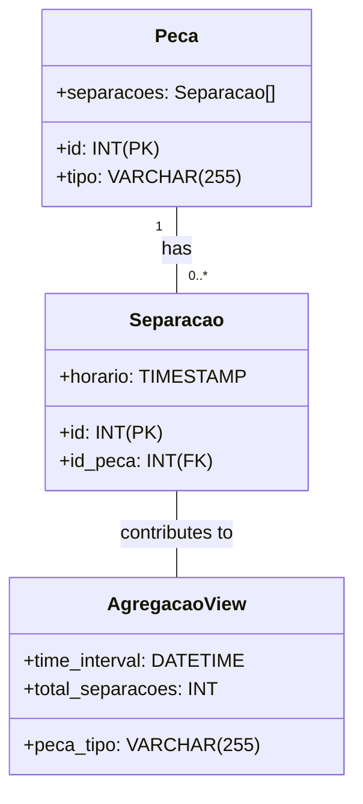

```mermaid
classDiagram
    class Peca {
        +id: INT (PK)
        +tipo: VARCHAR(255)
        +separacoes: Separacao[]
    }

    class Separacao {
        +id: INT (PK)
        +id_peca: INT (FK)
        +horario: TIMESTAMP
    }

    class AgregacaoView {
        +peca_tipo: VARCHAR(255)
        +time_interval: DATETIME
        +total_separacoes: INT
    }

    Peca "1" -- "0..*" Separacao : has
    Separacao -- AgregacaoView : contributes to
```